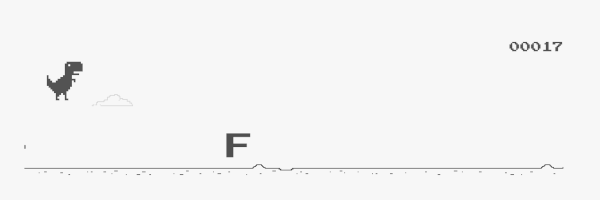

<h1 align="center">
  <br>
  <a href="https://chrisdothtml.github.io/chrome-dino" target="_blank"></a>
  <br>
  <br>
</h1>

This is the clone of the classical dyno game. The original code was written by [chrisdothtml](https://github.com/chrisdothtml/chrome-dino).

I have just tuned into a small keyboard training application. The game support just a first row of standard German keyboards.
I want to try the idea out, if it works more features will be added.

## Run locally (literally)

I use [volta](https://volta.sh/) to automatically install/switch my node and yarn versions. Either install volta, or check the versions I'm using via the [package.json](package.json) `volta` field.

```bash
# install deps
$ yarn
# start server
$ yarn start
```

## License

[MIT](license)
